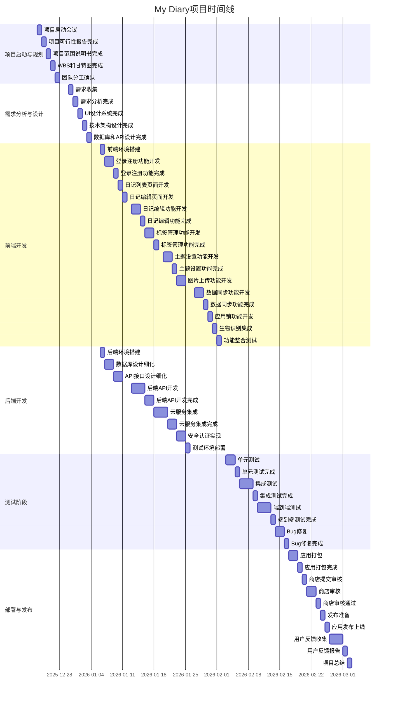

# 项目里程碑和时间线文档

## 1. 文档概述

### 1.1 文档目的
本文档详细描述了私人日记App - My Diary的项目里程碑和时间线，明确了项目各阶段的目标、关键交付物、时间安排和责任人，为项目团队提供清晰的进度指引和管理依据。

### 1.2 文档范围
本文档涵盖了My Diary App从项目启动到上线发布的完整时间线和主要里程碑，包括需求分析、设计、开发、测试、部署等各个阶段。

### 1.3 术语定义
| 术语 | 定义 |
|------|------|
| 里程碑 | 项目中的关键事件或节点，标志着一个阶段的完成 |
| 时间线 | 项目各任务和里程碑的时间安排 |
| 交付物 | 项目执行过程中产生的可交付成果 |
| 阶段 | 项目按时间顺序划分的工作单元 |
| 工期 | 完成一项任务或阶段所需的时间 |
| 依赖关系 | 任务之间的先后顺序关系 |

## 2. 项目概览

### 2.1 项目背景
My Diary是一款私人日记App，类似于谷歌商店中的My Diary应用，采用Flutter框架开发，支持Android和iOS平台。项目团队包括1名前端开发人员和2名后端开发人员，总工期为10周。

### 2.2 项目目标
- 开发一款功能完整、界面美观的私人日记App
- 支持用户认证、日记管理、标签管理、图片上传等核心功能
- 确保数据安全和隐私保护
- 实现本地存储和云端同步
- 提供良好的用户体验

### 2.3 项目阶段划分
| 阶段 | 时间范围 | 主要任务 |
|------|----------|----------|
| 项目启动与规划 | 第1周 | 项目可行性分析、范围定义、WBS分解、团队组建 |
| 需求分析与设计 | 第2周 | 需求收集、PRD编写、UI/UX设计、技术架构设计 |
| 前端开发 | 第3-6周 | 登录注册、日记编辑、标签管理、主题设置等功能开发 |
| 后端开发 | 第3-5周 | 数据库设计、API开发、安全认证、云服务集成 |
| 测试阶段 | 第7-8周 | 单元测试、集成测试、端到端测试、Bug修复 |
| 部署与发布 | 第9-10周 | 应用打包、商店审核、发布上线、用户反馈收集 |

## 3. 项目里程碑

### 3.1 里程碑定义
里程碑是项目中的关键节点，标志着一个阶段的完成或重要成果的交付。每个里程碑都有明确的时间点和交付物。

### 3.2 里程碑列表

| 里程碑ID | 里程碑名称 | 阶段 | 计划完成时间 | 关键交付物 | 责任人 | 状态 |
|----------|------------|------|--------------|------------|--------|------|
| MS-001 | 项目启动会议 | 项目启动与规划 | 第1周第1天 | 项目章程、团队分工文档 | 项目经理 | 已完成 |
| MS-002 | 项目可行性报告完成 | 项目启动与规划 | 第1周第2天 | 项目可行性报告 | 项目经理 | 已完成 |
| MS-003 | 项目范围说明书完成 | 项目启动与规划 | 第1周第3天 | 项目范围说明书 | 项目经理 | 已完成 |
| MS-004 | WBS和甘特图完成 | 项目启动与规划 | 第1周第4天 | WBS文档、甘特图 | 项目经理 | 已完成 |
| MS-005 | 需求分析完成 | 需求分析与设计 | 第2周第2天 | 用户需求文档(PRD) | 需求分析师 | 已完成 |
| MS-006 | UI设计系统完成 | 需求分析与设计 | 第2周第3天 | UI设计系统文档、设计稿 | UI设计师 | 已完成 |
| MS-007 | 技术架构设计完成 | 需求分析与设计 | 第2周第4天 | 技术架构文档 | 技术负责人 | 已完成 |
| MS-008 | 数据库设计完成 | 需求分析与设计 | 第2周第5天 | 数据库设计文档 | 后端开发1 | 已完成 |
| MS-009 | API接口设计完成 | 需求分析与设计 | 第2周第5天 | API接口设计文档 | 后端开发2 | 已完成 |
| MS-010 | 登录注册功能完成 | 前端开发 | 第3周第3天 | 登录注册页面、认证功能 | 前端开发 | 进行中 |
| MS-011 | 日记编辑功能完成 | 前端开发 | 第4周第2天 | 日记编辑页面、富文本编辑器 | 前端开发 | 待开始 |
| MS-012 | 标签管理功能完成 | 前端开发 | 第4周第5天 | 标签列表、标签编辑功能 | 前端开发 | 待开始 |
| MS-013 | 主题设置功能完成 | 前端开发 | 第5周第2天 | 主题切换、字体设置 | 前端开发 | 待开始 |
| MS-014 | 数据同步功能完成 | 前端开发 | 第6周第2天 | 本地存储、云端同步 | 前端开发 | 待开始 |
| MS-015 | 后端API开发完成 | 后端开发 | 第5周第5天 | API接口、文档 | 后端开发1,2 | 待开始 |
| MS-016 | 云服务集成完成 | 后端开发 | 第5周第5天 | Firebase集成、安全配置 | 后端开发1 | 待开始 |
| MS-017 | 单元测试完成 | 测试阶段 | 第7周第2天 | 单元测试报告 | 测试人员 | 待开始 |
| MS-018 | 集成测试完成 | 测试阶段 | 第7周第5天 | 集成测试报告 | 测试人员 | 待开始 |
| MS-019 | 端到端测试完成 | 测试阶段 | 第8周第3天 | 端到端测试报告 | 测试人员 | 待开始 |
| MS-020 | Bug修复完成 | 测试阶段 | 第8周第5天 | Bug修复记录 | 开发团队 | 待开始 |
| MS-021 | 应用打包完成 | 部署与发布 | 第9周第2天 | 安装包(APK/IPA) | 开发团队 | 待开始 |
| MS-022 | 商店审核通过 | 部署与发布 | 第9周第5天 | 审核通过证明 | 项目经理 | 待开始 |
| MS-023 | 应用发布上线 | 部署与发布 | 第10周第2天 | 上线通知 | 项目经理 | 待开始 |
| MS-024 | 用户反馈收集 | 部署与发布 | 第10周第5天 | 用户反馈报告 | 产品经理 | 待开始 |

## 4. 项目时间线

### 4.1 甘特图（文字版）

| 周/天 | 周一 | 周二 | 周三 | 周四 | 周五 |
|-------|------|------|------|------|------|
| **第1周** | 项目启动会议 MS-001 | 可行性报告完成 MS-002 | 范围说明书完成 MS-003 | WBS和甘特图完成 MS-004 | 团队分工确认 |
| **第2周** | 需求收集 | 需求分析完成 MS-005 | UI设计系统完成 MS-006 | 技术架构设计完成 MS-007 | 数据库和API设计完成 MS-008, MS-009 |
| **第3周** | 前端环境搭建 后端环境搭建 | 登录注册页面开发 | 登录注册功能完成 MS-010 | 日记列表页面开发 | 日记编辑页面开发 |
| **第4周** | 日记编辑功能开发 | 日记编辑功能完成 MS-011 | 标签管理功能开发 | 标签管理功能开发 | 标签管理功能完成 MS-012 |
| **第5周** | 主题设置功能开发 | 主题设置功能完成 MS-013 | 图片上传功能开发 | 后端API开发完成 MS-015 | 云服务集成完成 MS-016 |
| **第6周** | 数据同步功能开发 | 数据同步功能完成 MS-014 | 应用锁功能开发 | 生物识别集成 | 功能整合测试 |
| **第7周** | 单元测试 | 单元测试完成 MS-017 | 集成测试 | 集成测试 | 集成测试完成 MS-018 |
| **第8周** | 端到端测试 | 端到端测试 | 端到端测试完成 MS-019 | Bug修复 | Bug修复完成 MS-020 |
| **第9周** | 应用打包 | 应用打包完成 MS-021 | 商店提交审核 | 商店审核 | 商店审核通过 MS-022 |
| **第10周** | 发布准备 | 应用发布上线 MS-023 | 用户反馈收集 | 项目总结 | 用户反馈报告 MS-024 |

### 4.2 关键路径
关键路径是项目中最长的任务序列，决定了项目的最短完成时间。My Diary项目的关键路径如下：

1. 项目启动与规划 (1周) → 
2. 需求分析与设计 (1周) → 
3. 前端开发 (4周) → 
4. 测试阶段 (2周) → 
5. 部署与发布 (2周)

总工期：10周

### 4.3 任务依赖关系

| 任务ID | 任务名称 | 前置任务 | 依赖关系 |
|--------|----------|----------|----------|
| T-001 | 项目可行性报告 | - | 无 |
| T-002 | 项目范围说明书 | T-001 | 完成-开始 |
| T-003 | WBS和甘特图 | T-002 | 完成-开始 |
| T-004 | 用户需求文档 | T-003 | 完成-开始 |
| T-005 | UI设计系统 | T-004 | 完成-开始 |
| T-006 | 技术架构设计 | T-004 | 完成-开始 |
| T-007 | 数据库设计 | T-006 | 完成-开始 |
| T-008 | API接口设计 | T-007 | 完成-开始 |
| T-009 | 登录注册功能开发 | T-005, T-008 | 完成-开始 |
| T-010 | 日记编辑功能开发 | T-009 | 完成-开始 |
| T-011 | 标签管理功能开发 | T-010 | 完成-开始 |
| T-012 | 主题设置功能开发 | T-011 | 完成-开始 |
| T-013 | 数据同步功能开发 | T-012 | 完成-开始 |
| T-014 | 后端API开发 | T-008 | 完成-开始 |
| T-015 | 云服务集成 | T-014 | 完成-开始 |
| T-016 | 单元测试 | T-013, T-015 | 完成-开始 |
| T-017 | 集成测试 | T-016 | 完成-开始 |
| T-018 | 端到端测试 | T-017 | 完成-开始 |
| T-019 | Bug修复 | T-018 | 完成-开始 |
| T-020 | 应用打包 | T-019 | 完成-开始 |
| T-021 | 商店审核 | T-020 | 完成-开始 |
| T-022 | 应用发布 | T-021 | 完成-开始 |
| T-023 | 用户反馈收集 | T-022 | 完成-开始 |

## 5. 资源分配

### 5.1 人力资源分配

| 角色 | 姓名 | 主要负责任务 | 时间分配 |
|------|------|--------------|----------|
| 项目经理 | 张三 | 项目规划、进度管理、团队协调 | 100% |
| 前端开发 | 李四 | UI实现、功能开发、测试 | 100% |
| 后端开发1 | 王五 | 数据库设计、API开发、云服务集成 | 100% |
| 后端开发2 | 赵六 | API设计、安全认证、测试 | 100% |
| UI设计师 | 钱七 | UI/UX设计、设计系统构建 | 50% (第2周) |
| 测试人员 | 孙八 | 单元测试、集成测试、端到端测试 | 100% (第7-8周) |

### 5.2 设备资源分配

| 设备类型 | 数量 | 用途 | 负责人 |
|----------|------|------|--------|
| 开发电脑 | 4台 | 代码开发、测试 | 项目团队 |
| 测试手机 | 2台(Android, iOS) | 应用测试 | 测试人员 |
| 服务器 | 1台 | 后端开发、测试环境 | 后端开发1 |

### 5.3 软件资源分配

| 软件名称 | 版本 | 用途 | 负责人 |
|----------|------|------|--------|
| Android Studio | 2023.3.1 | Flutter开发、调试 | 前端开发 |
| Visual Studio Code | 1.85.0 | 后端开发 | 后端开发1,2 |
| Figma | 最新版 | UI/UX设计 | UI设计师 |
| Firebase | 最新版 | 云服务集成 | 后端开发1 |
| Flutter | 3.16.0 | 应用开发 | 前端开发 |
| SQLite | 3.44.0 | 本地数据库 | 前端开发 |
| Git | 2.43.0 | 版本控制 | 项目团队 |

## 6. 里程碑监控与控制

### 6.1 监控方法
- **定期会议**：每周一召开项目进度会议，讨论上周进度、本周计划和存在的问题
- **进度报告**：每周五提交项目进度报告，包括完成的任务、计划的任务、延迟的任务和解决方案
- **里程碑检查**：每个里程碑完成时进行检查，确保交付物符合质量要求
- **风险监控**：定期评估项目风险，及时采取措施应对风险

### 6.2 进度控制
- **进度跟踪**：使用甘特图和燃尽图跟踪项目进度
- **偏差分析**：分析实际进度与计划进度的偏差，找出原因
- **调整计划**：如果出现进度偏差，及时调整项目计划，重新安排资源
- **变更管理**：严格控制项目变更，确保变更不会影响项目进度

### 6.3 质量控制
- **交付物审查**：每个里程碑的交付物都要经过审查，确保符合质量标准
- **测试验证**：通过单元测试、集成测试、端到端测试验证功能的正确性
- **用户反馈**：收集用户反馈，持续改进产品质量

## 7. 风险与应对措施

### 7.1 风险识别

| 风险ID | 风险描述 | 可能性 | 影响程度 | 风险等级 |
|--------|----------|--------|----------|----------|
| R-001 | 需求变更频繁 | 中 | 高 | 中高 |
| R-002 | 技术难点未及时解决 | 中 | 高 | 中高 |
| R-003 | 开发进度延迟 | 中 | 中 | 中 |
| R-004 | 测试不充分导致上线后Bug多 | 中 | 高 | 中高 |
| R-005 | 第三方服务不稳定 | 低 | 高 | 中 |
| R-006 | 人员变动影响项目进度 | 低 | 高 | 中 |

### 7.2 应对措施

| 风险ID | 应对措施 | 负责人 |
|--------|----------|--------|
| R-001 | 建立变更管理流程，严格控制需求变更；做好需求文档的版本管理 | 项目经理 |
| R-002 | 提前识别技术难点，进行技术预研；寻求外部技术支持 | 技术负责人 |
| R-003 | 合理安排任务，设置缓冲时间；加强进度监控，及时调整计划 | 项目经理 |
| R-004 | 制定详细的测试计划，增加测试时间；引入自动化测试工具 | 测试人员 |
| R-005 | 选择稳定的第三方服务；制定备用方案；做好数据备份 | 后端开发1 |
| R-006 | 加强团队沟通，提高团队凝聚力；做好知识共享和文档记录 | 项目经理 |

## 8. 项目收尾计划

### 8.1 项目验收标准
- 所有功能均已实现并通过测试
- 应用符合UI/UX设计要求
- 应用性能满足要求
- 应用已成功发布到应用商店
- 所有文档已完成并归档

### 8.2 项目交付物
- 完整的应用程序(APK/IPA)
- 源代码
- 项目文档(PRD、设计文档、技术文档等)
- 测试报告
- 用户手册

### 8.3 项目总结
- 召开项目总结会议，回顾项目过程和成果
- 编写项目总结报告，分析项目的成功与不足
- 收集经验教训，为未来项目提供参考
- 完成项目归档，包括代码、文档和数据

## 9. 附录

### 9.1 里程碑交付物清单

| 里程碑ID | 里程碑名称 | 交付物 | 格式 |
|----------|------------|--------|------|
| MS-001 | 项目启动会议 | 项目章程 | 文档 |
| MS-002 | 项目可行性报告完成 | 项目可行性报告 | 文档 |
| MS-003 | 项目范围说明书完成 | 项目范围说明书 | 文档 |
| MS-004 | WBS和甘特图完成 | WBS文档、甘特图 | 文档、图表 |
| MS-005 | 需求分析完成 | 用户需求文档(PRD) | 文档 |
| MS-006 | UI设计系统完成 | UI设计系统文档、设计稿 | 文档、设计文件 |
| MS-007 | 技术架构设计完成 | 技术架构文档 | 文档 |
| MS-008 | 数据库设计完成 | 数据库设计文档 | 文档 |
| MS-009 | API接口设计完成 | API接口设计文档 | 文档 |
| MS-010 | 登录注册功能完成 | 登录注册功能代码、测试报告 | 代码、测试报告 |
| MS-011 | 日记编辑功能完成 | 日记编辑功能代码、测试报告 | 代码、测试报告 |
| MS-012 | 标签管理功能完成 | 标签管理功能代码、测试报告 | 代码、测试报告 |
| MS-013 | 主题设置功能完成 | 主题设置功能代码、测试报告 | 代码、测试报告 |
| MS-014 | 数据同步功能完成 | 数据同步功能代码、测试报告 | 代码、测试报告 |
| MS-015 | 后端API开发完成 | API代码、API文档 | 代码、文档 |
| MS-016 | 云服务集成完成 | 云服务集成代码、配置文件 | 代码、配置文件 |
| MS-017 | 单元测试完成 | 单元测试代码、单元测试报告 | 代码、测试报告 |
| MS-018 | 集成测试完成 | 集成测试报告 | 测试报告 |
| MS-019 | 端到端测试完成 | 端到端测试报告 | 测试报告 |
| MS-020 | Bug修复完成 | Bug修复记录 | 文档 |
| MS-021 | 应用打包完成 | 安装包(APK/IPA) | 安装文件 |
| MS-022 | 商店审核通过 | 审核通过证明 | 截图、文档 |
| MS-023 | 应用发布上线 | 上线通知、应用链接 | 通知、链接 |
| MS-024 | 用户反馈收集 | 用户反馈报告 | 文档 |

### 9.2 时间线甘特图（Mermaid语法）

---

**文档版本**：v1.0
**创建日期**：2025年12月28日
**审核人**：[待填写]
**批准人**：[待填写]